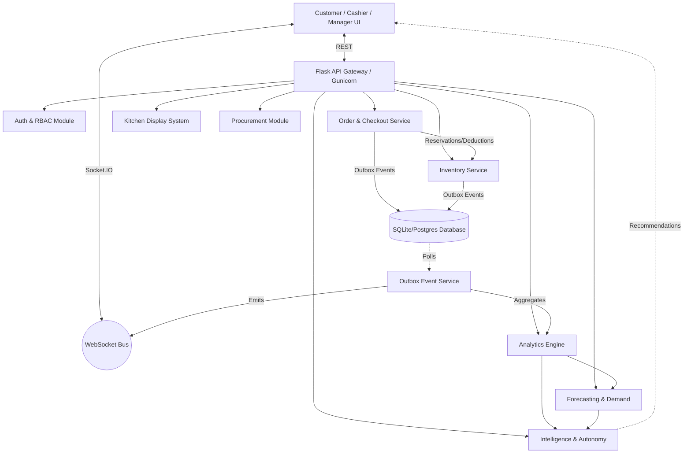

# Phase 15: System-Wide Architecture Review & Validation

## 1. Architecture Map (End-to-End)

## 2. Source-Of-Truth Map

| Entity | Authoritative Component / Module |
|---|---|
| **Users / Roles** | Database `User` table (managed by Auth Module) |
| **Products & Menu** | Database `Product`, `Category`, `GlobalProduct` (managed by Central/Canteen Manager) |
| **Inventory** | Database `Inventory` & `InventoryTransaction` (strict atomic ops in Inventory Service) |
| **Orders** | Database `Order` & `OrderItem` (Order Service) |
| **Payments** | Order Service + Payment Provider (Simulated in Phase 5) |
| **Kitchen State** | Database `Fulfillment` (KDS Service) |
| **Suppliers** | Database `Supplier` & `SupplierProduct` (Procurement Service) |
| **Intelligence** | Database `IntelligenceSignal` & `Recommendation` |

## 3. Findings & Technical Debt (Audit)

1. **Authentication**: Solid. JWT based. Middleware correctly handles RBAC.
2. **WebSockets**: Implemented via Flask-SocketIO. Reliable offline state recovery exists (added in Phase 13). 
3. **Database & Transactions**: `OutboxEvent` provides durable message publishing alongside business logic.
4. **Inventory Concurrency**: `InventoryService.atomic_deduct` and `atomic_reserve` are in place. Tests pass.
5. **Checkout**: Idempotency is enabled (`IdempotencyRecord`).
6. **Duplicate/Unused**: 
   - No major duplicate services observed. The architecture has remained modular (Blueprint based).
7. **Cache**: No external cache (e.g. Redis) is deployed. In-memory and DB-based caching (response caching) are used.
8. **Logging / Observability**: Basic logging is implemented. We have a correlation ID middleware (`X-Correlation-ID`) implemented in Phase 13.
9. **Configuration**: Hardcoded variables are kept to a minimum, using `config.py`.

## 4. Prioritized Action Plan for Phase 15

- [ ] **P0: High-Concurrency Simulation** (Validate Inventory + Checkout under load)
- [ ] **P0: Failure Injection** (Simulate Event Bus/WebSocket failure to ensure core ordering survives)
- [ ] **P1: API Error Standardization** (Ensure all endpoints return the standard `{ success: bool, error: { code, message } }` format)
- [ ] **P1: IDOR & Security Sweep** (Verify Canteen A manager cannot edit Canteen B inventory)
- [ ] **P1: Final Seed Data & Demo Reset** (Create a reliable hackathon demo setup)
- [ ] **P2: Performance Measurement** (Run tests to capture P50/P99 latency)
