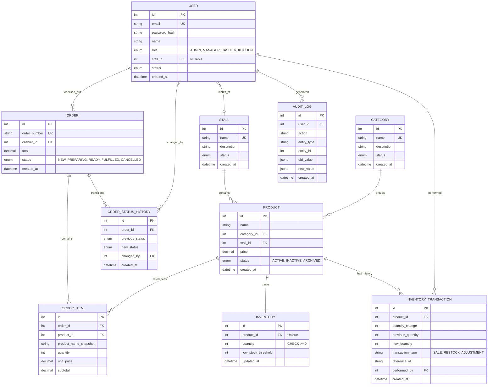

# Database Architecture & ERD

## Important Architectural Decisions

### 1. User Roles
**Decision:** A simple `role` enum field on the `User` table (e.g., ADMIN, CANTEEN_MANAGER, CASHIER, KITCHEN_STAFF).
**Reasoning:** The MVP has well-defined, distinct roles. A normalized RBAC structure (Roles/Permissions tables) adds unnecessary join complexity and maintenance overhead for a hackathon. If a user needs multiple roles later, we can expand it, but an enum is perfectly sufficient for Phase 0.

### 2. Product Availability
**Decision:** Derived dynamically. `Product` will have a `status` (ACTIVE, INACTIVE, ARCHIVED). `Inventory` will have `quantity`.
**Reasoning:** Effective availability is `Product.status == ACTIVE && Inventory.quantity > 0`. Storing an independent `availability` field risks state divergence (e.g., quantity is 0 but availability says AVAILABLE).

### 3. Inventory to Product Relationship
**Decision:** One-to-One (`Inventory` belongs exactly to one `Product`).
**Reasoning:** Since a product belongs to one stall, its inventory is singular. We separate `Inventory` from `Product` to isolate highly volatile concurrent updates (inventory deductions) from relatively static master data (product names, prices), reducing row lock contention on the `Product` table.

### 4. Historical Product Information Preservation
**Decision:** Order items will capture a snapshot of the product details at checkout.
**Reasoning:** If a Canteen Manager renames "Chicken Burger" to "Spicy Burger", historical receipts must still read "Chicken Burger". `OrderItem` will store `product_name_snapshot`.

### 5. Historical Prices Preservation
**Decision:** `OrderItem` will store the `unit_price` at the time of purchase.
**Reasoning:** Product prices are dynamic. Storing the unit price in `OrderItem` ensures historical order totals never mutate when the master `Product.price` changes.

### 6. Multi-Stall Orders Representation
**Decision:** A single `Order` can have multiple `OrderItem`s, and each `OrderItem` references a `Product` which references a `Stall`.
**Reasoning:** This inherently supports multi-stall orders without complex routing tables. The KDS (Kitchen Display System) can simply query `OrderItems` filtered by the Kitchen Staff's assigned `Stall`.

### 7. Kitchen Assignments Representation
**Decision:** `User` (where role is KITCHEN_STAFF) will have a nullable `stall_id`.
**Reasoning:** This is the simplest way to assign staff to fulfill orders for a specific stall. It directly links the worker to their workstation.

### 8. Foreign-Key Deletion Rules
**Decision:** Restrict or Set Null. **No CASCADE deletes on historical data.**
**Reasoning:** If a Manager deletes a Category, we should prevent it (RESTRICT) if products depend on it. We use soft-deletes (`status = ARCHIVED`) for Products instead of physical deletion so that `OrderItem.product_id` never breaks.

### 9. Justified Indexes
**Decision:** 
- `Inventory.product_id` (For rapid locking/deduction).
- `Order.status` and `Order.created_at` (For the live order queue and historical reporting).
- `OrderItem.order_id` (For rapid retrieval of order contents).
- `OrderStatusHistory.order_id` (For timeline rendering).
**Reasoning:** We index only what is necessary for the real-time queues and concurrent access.

### 10. Constraints: PostgreSQL vs Backend Logic
**Decision:** PostgreSQL will enforce `price >= 0` and `quantity >= 0` (CHECK constraints) and structural referential integrity. The backend will enforce business transitions (e.g., an Order can't go from NEW to FULFILLED directly).
**Reasoning:** Database CHECK constraints guarantee inventory never drops below zero regardless of race conditions, serving as the ultimate concurrency failsafe.

---

## Entity Relationship Diagram (ERD)



## Concurrency Strategy

The most critical requirement is preventing inventory overselling.
We solve this using **Database Transaction Boundaries and Conditional Updates**:

```sql
BEGIN;

-- 1. Atomically deduct inventory ONLY if sufficient quantity exists
UPDATE inventory 
SET quantity = quantity - :requested, updated_at = NOW()
WHERE product_id = :pid AND quantity >= :requested;

-- 2. Check if the update succeeded (rowcount == 1)
-- If rowcount == 0, we ROLLBACK. The item is out of stock.
-- If rowcount == 1, we continue.

-- 3. Create Order
INSERT INTO orders ...

-- 4. Create OrderItem
INSERT INTO order_items ...

-- 5. Create InventoryTransaction history
INSERT INTO inventory_transactions ...

COMMIT;
```
By utilizing the atomic nature of the SQL `UPDATE` combined with a `WHERE quantity >= X` condition, the database strictly serializes these modifications. Concurrent cashiers attempting to buy the last burger will race; PostgreSQL ensures only one transaction successfully modifies the row, while the other sees `rowcount = 0` and is safely aborted by the application.
